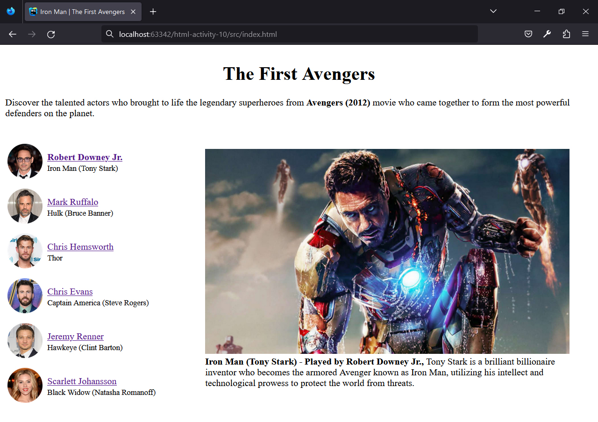
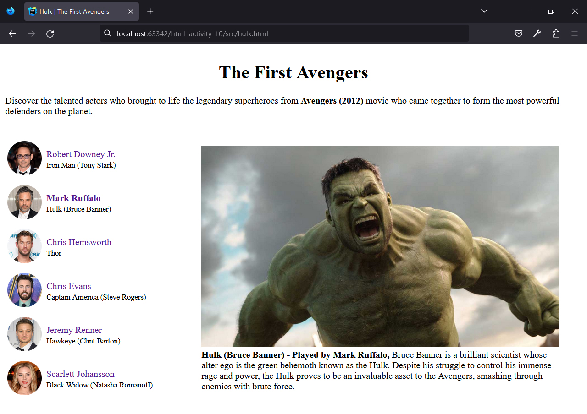
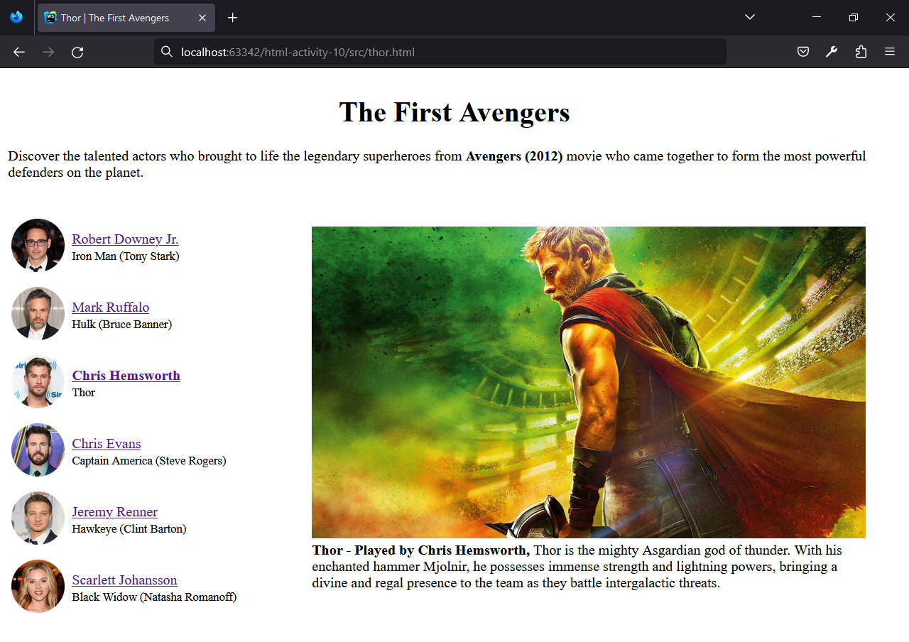
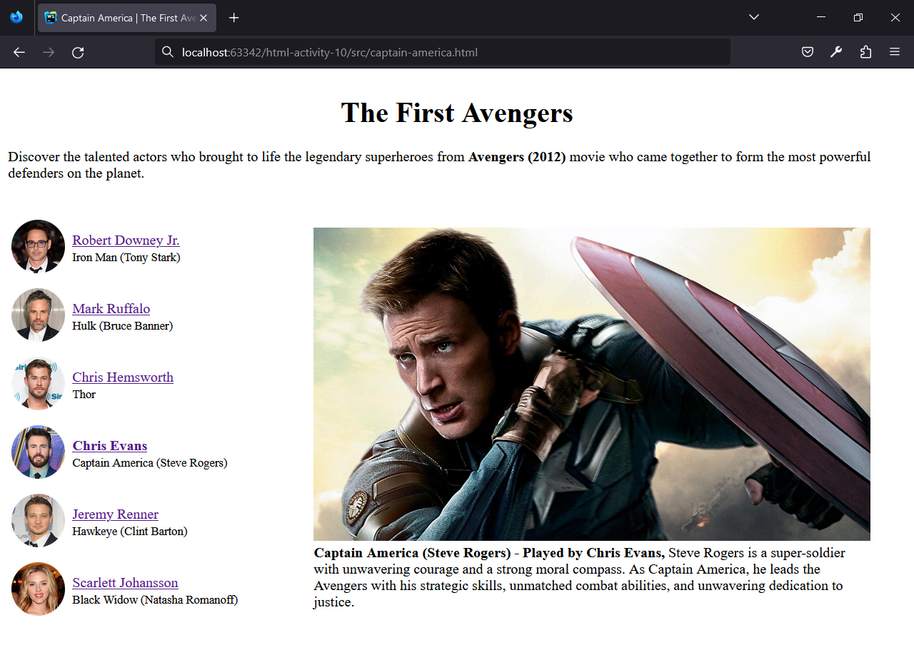
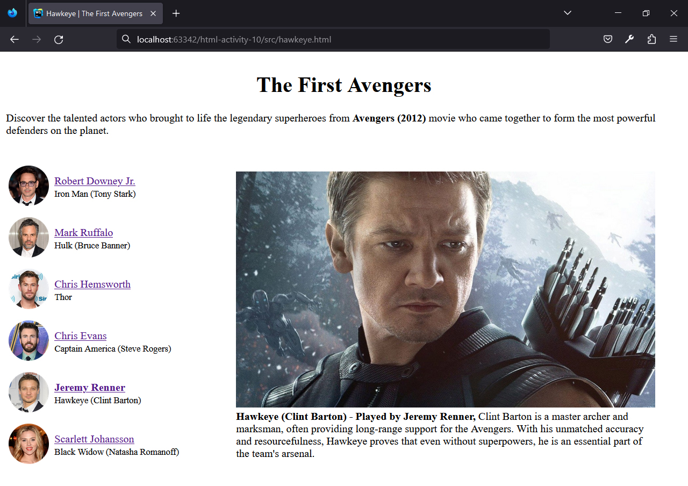
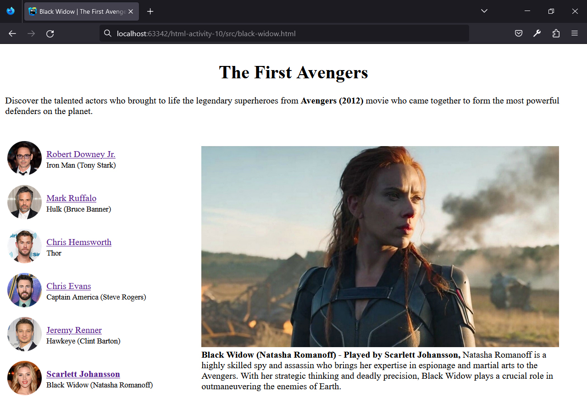

## HTML | Activity #10: Images and Links
Create a website called **The First Avengers**.


### Development Setup
Create the necessary files and folders inside the [**src**](/src) folder.
To test your output, simply open any of your html files in your preferred web browser.

#### Folder Structure
```shell
├── src/
│   ├── black-widow.html
│   ├── captain-america.html
│   ├── hawkeye.html
│   ├── hulk.html
│   ├── index.html
│   └── thor.html
```


### Required Pages
#### Page 1: Iron Man `index.html`


#### Page 2: Hulk `hulk.html`


#### Page 3: Thor `thor.html`


#### Page 4: Thor `captain-america.html`


#### Page 5: Thor `hawkeye.html`


#### Page 6: Thor `black-widow.html`



### Additional Requirements
- Images of the cast members and their names should be clickable links that lead to their respective pages.
- Update the page's `<title>` and the highlighted navigation item based on the selected page.
- Display the character image in accordance with the maximum width of the screen:

    | Screen Max Width | Image Dimension |
    |:----------------:|----------------:|
    |      320px       |       320 x 180 |
    |      480px       |       480 x 270 |
    |      768px       |       768 x 432 |
    |      992px       |       992 x 558 |
    |     Default      |      1280 x 720 |

